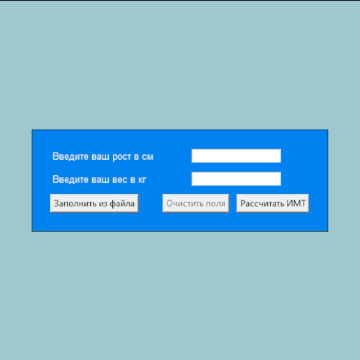

## Расчет индекса массы тела (ИМТ)



Запуск десктопный программы по следующей команде:

```python
python main.py
```
Использовалась библиотека **tkinter**. Документация по нему [тут](http://tkdocs.com/tutorial/index.html)

В данной простой десктопной программе имеется возможность:
+ заполнения полей ввода данных из текстового файла (*.txt), который должен быть в следующем формате: 
"Вec <значение>\nРост <значение>"
где значение представляет собой число[^1]
+ очистки полей ввода данных от введенных значений по нажатию на соответствующую кнопку[^1]
+ валидации полей ввода данных с выводом ошибки в случае введения пустых данных, нуля и т.д.[^1]
+ непосредственного расчета самого показателя ИМТ

Чтобы сделать программу исполняемым файлом (exe), нужно установить пакет:
```python
pip install auto-py-to-exe
```

Затем запустить его в терминале при помощи команды ниже и в открывшемся окне выбрать "One Directory" и "Windows Based":
```python
auto-py-to-exe
```
В папке "output", подпапке "main" будет лежать **main.exe**.

[Источники](https://skillbox.ru/media/code/pishem-desktopprilozhenie-na-python-s-pomoshchyu-tkinter/).

[^1]: добавлены мной 